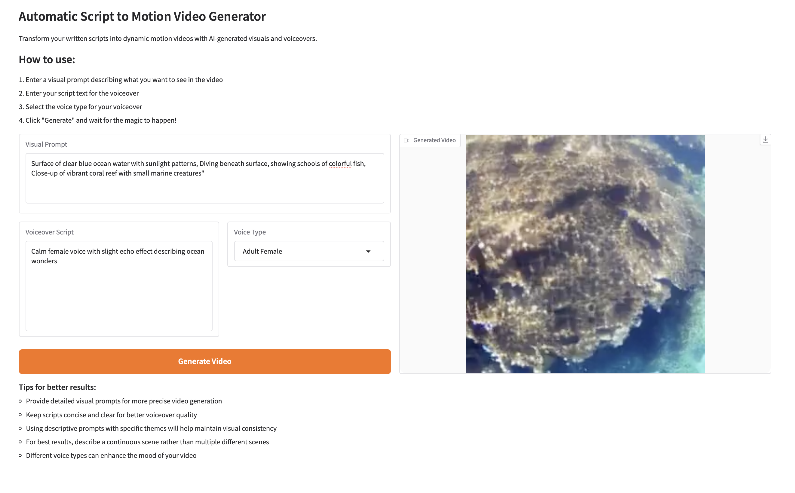

# Script to Motion Video Generator

Transform your written scripts into dynamic motion videos with AI-generated visuals and voiceovers using this Python-based tool. Powered by Hugging Face's text-to-video diffusion models, Google Text-to-Speech (gTTS), and Gradio for an interactive UI, this project generates continuous video segments with voiceovers in various styles.

## Features
- **Text-to-Video Generation**: Convert text prompts into short video clips using the `damo-vilab/text-to-video-ms-1.7b` model.
- **Voiceover Integration**: Add audio narration to videos with customizable voice types (Adult Male, Adult Female, Child, Elderly, Professional).
- **Segment Continuity**: Generate multi-segment videos with smooth transitions between segments for a cohesive story.
- **Interactive UI**: Use a Gradio interface to input prompts, scripts, and voice preferences, and preview the generated video.
- **GPU Support**: Optimized for CUDA-enabled GPUs to accelerate video generation.

## Prerequisites
- Python 3.11+
- CUDA-enabled GPU (optional, for faster processing)
- FFmpeg installed on your system
- A Hugging Face account and API token (for accessing the diffusion model)

## Installation

1. **Clone the Repository**
   ```bash
   git clone https://github.com/your-username/script-to-motion-video-generator.git
   cd script-to-motion-video-generator
2. **Install FFmpeg**
   ```On macOS (using Homebrew)
      brew install ffmpeg

3. **Set Up a Virtual Environment (Optional but Recommended)**
   ```bash
   python -m venv venv
   source venv/bin/activate  # On Windows: venv\Scripts\activate

5. **Install Dependencies**
   ```bash
   pip install -r requirements.txt


7. **Set Up Hugging Face Token**
   
   Obtain a token from Hugging Face.
   Replace the placeholder token in script_to_motion.py with your own:
      os.environ["HUGGING_FACE_HUB_TOKEN"] = "your-hugging-face-token"

**Usage**

*Running the Gradio Interface*

   1. Open a terminal in the project directory.
   2. Run the script:
      ```bash
      python script_to_motion.py

  A public URL will be generated (e.g., https://xxxx.gradio.live). Open it in your browser to access the UI.


### Instructions to Upload to GitHub
1. **Save the File**:
   - Copy the above content into a file named `README.md` in your project directory.
   - If you’re using a text editor, ensure it’s saved with a `.md` extension.

2. **Replace Placeholders**:
   - Replace `your-username` with your actual GitHub username in the clone URL.
   - Replace `"your-hugging-face-token"` with your actual Hugging Face token if you’re sharing the code publicly, or leave it as a placeholder and instruct users to set it themselves.

3. **Add to GitHub**:
   - Assuming you’ve already initialized a Git repository and added your project files (e.g., `script_to_motion.py`, `requirements.txt`), run these commands:
     ```bash
     git add README.md
     git commit -m "Add README file"
     git push origin main

**If you haven’t set up a repository yet:**

      git init
      git add README.md script_to_motion.py requirements.txt
      git commit -m "Initial commit with README, script, and requirements"
      git remote add origin https://github.com/your-username/script-to-motion-video-generator.git
      git push -u origin main
   
**Sample Outpu:**

*Prompt:*

Surface of clear blue ocean water with sunlight patterns, Diving beneath surface, showing schools of colorful fish, Close-up of vibrant coral reef with small marine creatures"

*Voice :*

Calm female voice with slight echo effect describing ocean wonders

*Interface:*


*Output Video*


